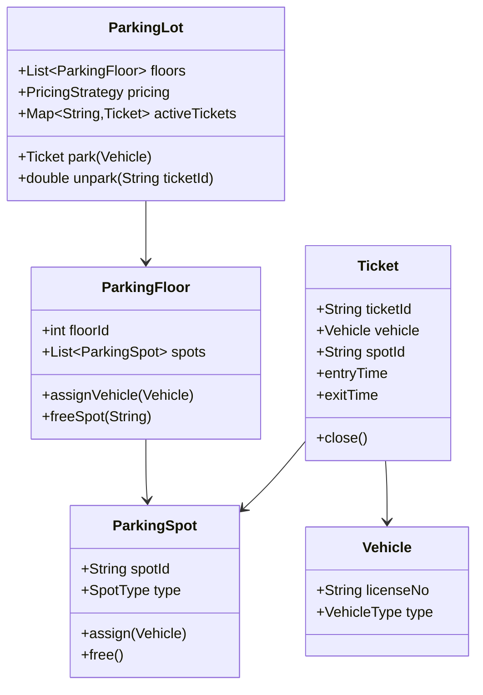

# 🚗 Parking Lot — Low Level Design (LLD)

A classic FAANG-style **Low Level Design** problem to model and implement a multi-floor parking lot system using **Object-Oriented Design principles**.

---

## Problem Statement

Design a parking lot system that supports:
- Multiple floors, each with several parking spots.  
- Different vehicle types: **Bike, Car, Truck**.  
- Each vehicle can park only in **compatible spot types**:
  - Bike → Motorbike / Compact / Large  
  - Car → Compact / Large  
  - Truck → Large only  

The system should:
1. Allow **vehicles to enter and exit**.  
2. **Allocate** a suitable free spot on entry.  
3. **Generate a parking ticket** when the vehicle enters.  
4. **Calculate fees** when the vehicle exits.  
5. **Free the spot** for future vehicles.

---

### UML


---

## Key Components

| Class | Responsibility |
|--------|----------------|
| `Vehicle` | Type + license number |
| `ParkingSpot` | Spot info, occupied/free, assign/free vehicle |
| `ParkingFloor` | Manages all spots and availability index |
| `Ticket` | Tracks vehicle, spot, entry/exit time |
| `PricingStrategy` | Calculates fee (Flat / Hourly) |
| `ParkingLot` | Orchestrates everything — entry/exit flow |

---

## Design Overview

```
ParkingLot
├── ParkingFloor(1..)
│ └── ParkingSpot(1..)
├── PricingStrategy
├── Ticket Map
└── AllocationService
```

- **Composition:** Floors contain multiple spots.  
- **Encapsulation:** Only methods like `assign()` / `free()` modify spot state.  
- **Single Responsibility:** Each class does one clear job.  
- **Strategy Pattern:** For flexible pricing models.  
- **Deterministic Allocation:** Lowest floor + lowest spot ID ensures predictable behavior.

---

## System Flow

### Vehicle Entry
1. Receive vehicle info.
2. Find a free compatible spot using `AllocationService`.
3. Assign the vehicle → mark spot occupied.
4. Generate a ticket and record entry time.

### Vehicle Exit
1. Locate ticket.
2. Compute duration and fee (via `PricingStrategy`).
3. Free the spot.
4. Close ticket and issue payment receipt.

---

## Example Pricing

| Strategy | Rule |
|-----------|------|
| `FlatRate` | Same price per hour (e.g., $10/hr) |
| `HourlySlab` | 1st hour $10, next hours $5/hr |
| `WeekendStrategy` *(optional)* | Different rates for weekends |

---

## What We Learn from This Problem

- How to **model real-world systems** using classes and relationships.  
- Applying **OOP principles**: abstraction, encapsulation, composition.  
- Using **Design Patterns** to make systems extensible.  
- Writing modular code that can evolve (add EV spots, payments, etc.).  

---

## Quick Commands

```bash
cd ParkingLot
pytest -v tests/
```

---